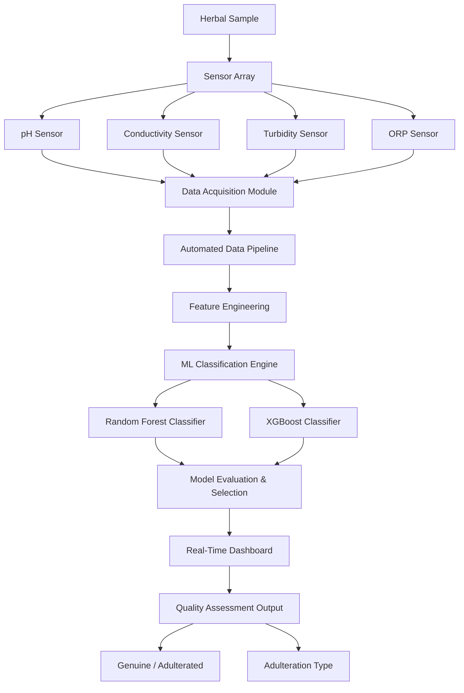
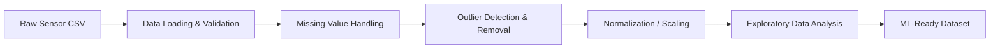
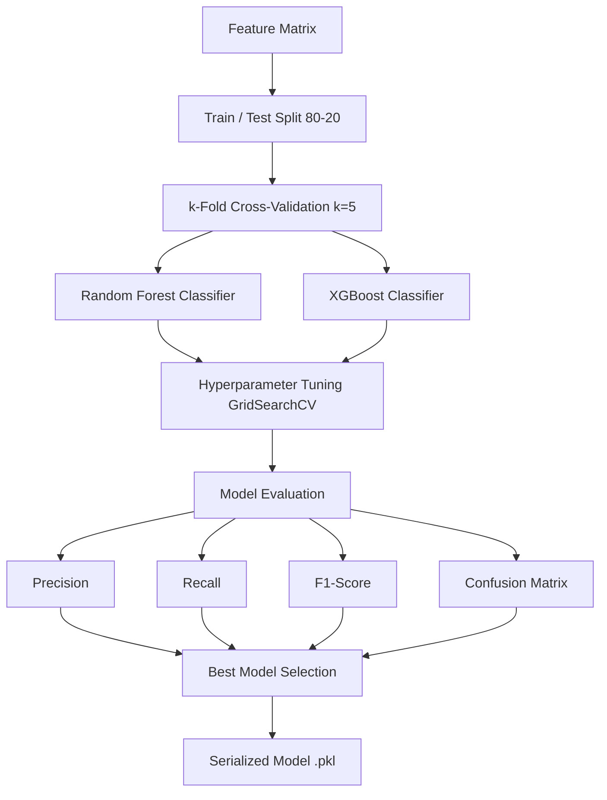

# 🌿 AayuSense — AI-Powered Electronic Tongue for Herbal Quality Assessment

[](https://python.org)
[](https://scikit-learn.org)
[](https://xgboost.readthedocs.io)
[](LICENSE)
[](https://www.sih.gov.in/)

> **SIH 2025 Qualifier Project** — An AI-driven Electronic Tongue (E-Tongue) system that uses multi-sensor arrays and machine learning to detect adulteration and assess quality in herbal samples.

---

## 📋 Table of Contents

- [Problem Statement](#problem-statement)
- [Motivation](#motivation)
- [System Architecture](#system-architecture)
- [Sensor Pipeline](#sensor-pipeline)
- [Data Processing Workflow](#data-processing-workflow)
- [Feature Engineering](#feature-engineering)
- [Machine Learning Workflow](#machine-learning-workflow)
- [Dashboard Overview](#dashboard-overview)
- [Project Structure](#project-structure)
- [Setup & Installation](#setup--installation)
- [Future Scope](#future-scope)
- [Roadmap](#roadmap)
- [Technologies Used](#technologies-used)

---

## 🎯 Problem Statement

The global herbal medicine market suffers from widespread adulteration and quality inconsistency. Traditional quality testing methods are:
- **Expensive** — requiring laboratory equipment and trained chemists
- **Slow** — results take days to weeks
- **Inaccessible** — not available at point-of-sale or field locations

AayuSense addresses this by providing a **low-cost, real-time, AI-powered quality assessment system** deployable in field conditions.

---

## 💡 Motivation

Herbal products are increasingly consumed globally for wellness and therapeutic purposes. Adulteration with inferior substitutes poses both health risks and economic harm to consumers. The vision of AayuSense is to democratize quality testing by embedding intelligence directly into affordable sensor hardware.

---

## 🏗️ System Architecture



---

## 🔬 Sensor Pipeline

The E-Tongue system uses a multi-parameter electrochemical sensor array:

| Sensor | Parameter | Unit | Role |
|--------|-----------|------|------|
| pH Electrode | Acidity/Basicity | pH units | Chemical composition indicator |
| Conductivity Probe | Ionic concentration | mS/cm | Dissolved solids detection |
| Turbidity Sensor | Optical clarity | NTU | Particulate matter analysis |
| ORP Sensor | Oxidation-Reduction Potential | mV | Redox activity profiling |

Data is collected via an **automated acquisition pipeline** that samples readings at configurable intervals, timestamps each record, and writes structured CSV output for downstream ML processing.

---

## 📊 Data Processing Workflow



**EDA Steps Performed:**
- Distribution analysis for each sensor channel
- Correlation matrix to identify feature relationships
- Class distribution inspection for adulteration categories
- Temporal drift analysis across acquisition sessions

---

## ⚙️ Feature Engineering

Features engineered from raw sensor readings:

| Feature | Description |
|---------|-------------|
| `ph_mean`, `ph_std` | Rolling statistics on pH channel |
| `conductivity_range` | Max - Min conductivity in window |
| `turbidity_gradient` | Rate of change of turbidity |
| `orp_baseline_delta` | Deviation from clean sample baseline |
| `sensor_cross_ratio` | pH × conductivity interaction term |

---

## 🤖 Machine Learning Workflow



**Classification Task**: Multi-class detection of adulteration categories (genuine vs. adulterant type A, B, C...)

**Evaluation Metrics Used**: Precision · Recall · F1-Score · Confusion Matrix · Cross-validation scores

---

## 📈 Dashboard Overview

A real-time analytics dashboard surfaces:
- **Live sensor readings** with time-series plots
- **Classification output** — sample identity and confidence
- **Historical log** of all tested samples
- **Alert system** for detected adulteration events

The dashboard is built with Python (Streamlit/Matplotlib) and provides a clean interface for non-technical operators.

---

## 📁 Project Structure

```
AayuSense-AI-ETongue/
├── README.md
├── requirements.txt
├── data/
│   ├── raw/                    # Raw sensor CSV files (add your data here)
│   └── processed/              # Cleaned, ML-ready datasets
├── models/                     # Trained model files (.pkl)
├── notebooks/
│   └── 01_eda_and_feature_engineering.ipynb
├── src/
│   ├── data_pipeline.py        # Sensor data loading & preprocessing
│   ├── feature_engineering.py  # Feature extraction functions
│   └── train_evaluate.py       # Model training & evaluation
├── dashboard/
│   └── app.py                  # Real-time dashboard application
├── hardware/
│   └── sensor_setup.md         # Hardware wiring & calibration guide
├── images/
│   └── (architecture diagrams, screenshots)
└── docs/
    └── architecture.md         # Detailed system documentation
```

---

## 🚀 Setup & Installation

```bash
# Clone the repository
git clone https://github.com/umeshpandeysh/AayuSense-AI-ETongue.git
cd AayuSense-AI-ETongue

# Create virtual environment
python -m venv venv
source venv/bin/activate  # Windows: venv\Scripts\activate

# Install dependencies
pip install -r requirements.txt

# Run EDA notebook
jupyter notebook notebooks/01_eda_and_feature_engineering.ipynb

# Train models
python src/train_evaluate.py

# Launch dashboard
streamlit run dashboard/app.py
```

---

## 🔭 Future Scope

- [ ] Expand sensor array with gas sensors and electronic nose (E-Nose) fusion
- [ ] Deploy lightweight model on microcontroller (Arduino / Raspberry Pi)
- [ ] Build mobile application for field operator use
- [ ] Collect larger, certified dataset for production-grade accuracy
- [ ] Explore deep learning (LSTM) for temporal sensor pattern recognition
- [ ] Add explainability layer (SHAP values) for audit-ready reports

---

## 🗺️ Roadmap

| Phase | Status | Description |
|-------|--------|-------------|
| Phase 1: Sensor Integration | ✅ Complete | Hardware setup, automated data acquisition |
| Phase 2: ML Pipeline | ✅ Complete | Feature engineering, RF & XGBoost training |
| Phase 3: Dashboard | ✅ Complete | Real-time classification dashboard |
| Phase 4: SIH 2025 | ✅ Qualified | Project selected for Smart India Hackathon |
| Phase 5: Edge Deployment | 🔄 In Progress | Microcontroller deployment |
| Phase 6: Mobile App | 📋 Planned | Android/iOS operator interface |

---

## 🛠️ Technologies Used

| Category | Tools |
|----------|-------|
| **Language** | Python 3.10+ |
| **ML** | Scikit-learn, XGBoost, Random Forest |
| **Data** | Pandas, NumPy, Matplotlib, Seaborn |
| **Dashboard** | Streamlit, Matplotlib |
| **Hardware** | pH/Conductivity/Turbidity/ORP sensors, Arduino/Raspberry Pi |
| **Other** | Jupyter, GridSearchCV, k-Fold CV |

---

## 🏆 Achievement

This project **qualified for Smart India Hackathon (SIH) 2025** — a national-level innovation competition organized by the Government of India.

---

## 📄 License

MIT License — see [LICENSE](LICENSE) for details.

---

<div align="center">

**AayuSense** | Built with ❤️ by [Umesh Pandey](https://github.com/umeshpandeysh)

</div>
