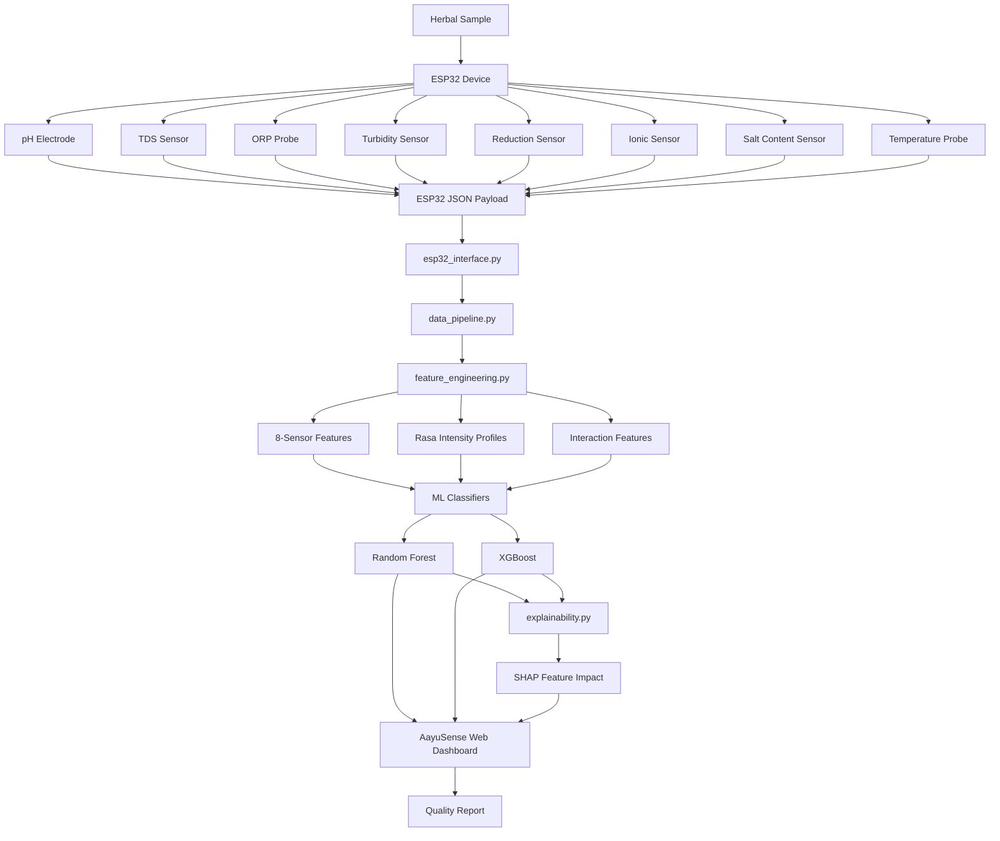
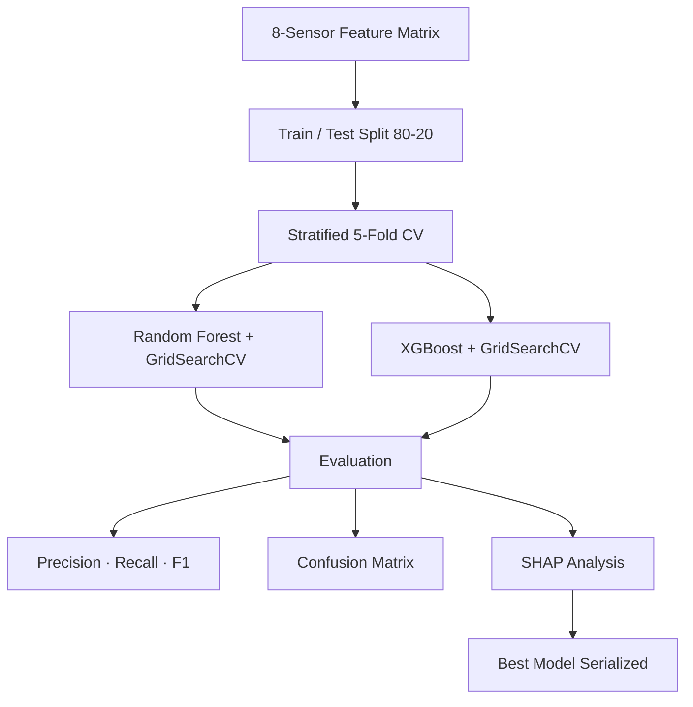

# 🌿 AayuSense — AI-Powered Electronic Tongue for Herbal Quality Assessment

[](https://python.org)
[](https://scikit-learn.org)
[](https://xgboost.readthedocs.io)
[](https://shap.readthedocs.io)
[](LICENSE)
[](https://www.sih.gov.in/)
[](https://aayu-sense.vercel.app)

> **SIH 2025 Qualifier** — The Python ML backend for AayuSense, a collaborative AI-driven Electronic Tongue (E-Tongue) system for herbal quality assessment and adulteration detection.
>
> 🌐 **Live web dashboard:** [aayu-sense.vercel.app](https://aayu-sense.vercel.app) · **Web app repo:** [Swayam-jhaa/AayuSense](https://github.com/Swayam-jhaa/AayuSense)

---

## 📋 Table of Contents
- [Project Overview](#project-overview)
- [System Architecture](#system-architecture)
- [Hardware — ESP32 Sensor Array](#hardware--esp32-sensor-array)
- [Rasa Profiling](#rasa-profiling)
- [ML Pipeline](#ml-pipeline)
- [SHAP Explainability](#shap-explainability)
- [Project Structure](#project-structure)
- [Setup & Installation](#setup--installation)
- [Quick Start](#quick-start)
- [Data Flow](#data-flow)
- [Team](#team)

---

## 🎯 Project Overview

The global herbal medicine market suffers from widespread adulteration. Traditional quality testing requires expensive lab equipment and trained chemists, making it inaccessible at point-of-sale or field locations.

**AayuSense** addresses this with a two-part system:
1. **Hardware layer** — ESP32 microcontroller with an 8-sensor electrochemical array
2. **ML layer** (this repo) — Python pipeline that classifies sensor readings as genuine or adulterated, with Rasa profiling and SHAP explainability
3. **Web layer** — Next.js dashboard at [aayu-sense.vercel.app](https://aayu-sense.vercel.app) that surfaces results

---

## 🏗️ System Architecture



---

## 🔬 Hardware — ESP32 Sensor Array

The AayuSense device uses an ESP32 microcontroller with 8 sensor channels:

| Sensor | Field Name | Unit | Role |
|--------|-----------|------|------|
| pH Electrode | `pH` | 0–14 | Acidity/basicity profile |
| TDS Probe | `TDS` | ppm | Total Dissolved Solids |
| ORP Sensor | `orp_mV` | mV | Oxidation-Reduction Potential |
| Turbidity Sensor | `turbidity` | 0–1 | Optical clarity (normalized) |
| Reduction Sensor | `Reduction_value` | 0–1 | Reduction activity |
| Ionic Sensor | `Ionic_value` | 0–1 | Ionic concentration |
| Salt Content | `Salt_content` | 0–1 | Salt loading index |
| Temperature | `temp_c` | °C | Ambient/solution temperature |

**ESP32 JSON payload format** (sent by firmware):
```json
{
  "sample_id": "S20250916-01",
  "device_id": "ESP32-01",
  "timestamp": "2025-09-16T09:12:00Z",
  "sensors": {
    "pH": 6.1, "TDS": 210, "orp_mV": 345,
    "turbidity": 0.14, "Reduction_value": 0.120,
    "Ionic_value": 0.080, "Salt_content": 0.220,
    "temp_c": 25.2
  },
  "herb_name": "Neem (Azadirachta indica)",
  "operator": "Umesh"
}
```

---

## 🪷 Rasa Profiling

One of AayuSense's unique contributions is **Rasa profiling** — mapping electrochemical sensor readings to the six Ayurvedic taste categories (Rasas) that characterise herbal quality in traditional Indian medicine:

| Rasa | English | Key Sensor Correlates |
|------|---------|----------------------|
| Madhura | Sweet | Low pH, moderate TDS, low ORP |
| Amla | Sour | Low pH, high ORP |
| Lavana | Salty | High TDS, Salt_content, Ionic_value |
| Tikta | Bitter | High ORP, high Reduction_value |
| Katu | Pungent | High ORP, reduction, temperature |
| Kashaya | Astringent | High Ionic_value, Reduction_value |

See [`docs/rasa_profiling.md`](docs/rasa_profiling.md) for methodology.

---

## 🤖 ML Pipeline



**Herbs in dataset:**
- Neem (Azadirachta indica)
- Turmeric (Curcuma longa)
- Ashwagandha (Withania somnifera)

**Classification task:** Binary — Genuine vs. Adulterated (probability score 0.0–1.0, threshold 0.5)

---

## 🔍 SHAP Explainability

Every prediction includes a SHAP-based explanation identifying the most influential sensors. This matches the feature impact view in the AayuSense web dashboard:

```python
from src.explainability import AayuSenseExplainer
explainer = AayuSenseExplainer(model, feature_names)
explainer.fit(X_train)
shap_values = explainer.compute_shap_values(X_test)
top_features = explainer.get_top_features(shap_values, class_index=0, k=3)
# [{"feature": "Salt_content", "impact": 0.38}, ...]
```

---

## 📁 Project Structure

```
AayuSense-AI-ETongue/
├── README.md
├── requirements.txt
├── config/
│   └── model_config.yaml        # Training hyperparameter config
├── data/
│   ├── raw/                     # ESP32 sensor CSV exports
│   └── processed/               # Cleaned, feature-engineered datasets
├── models/                      # Trained model files (.pkl / .joblib)
├── notebooks/
│   ├── 01_eda_and_feature_engineering.ipynb
│   └── 02_model_training_evaluation.ipynb
├── src/
│   ├── esp32_interface.py       # ESP32 JSON payload parser & validator
│   ├── data_pipeline.py         # 8-sensor data loading & preprocessing
│   ├── feature_engineering.py   # Features + Rasa profiling
│   ├── sensor_simulator.py      # Synthetic data generator (dev/testing)
│   ├── train_evaluate.py        # RF + XGBoost training pipeline
│   ├── predict.py               # Inference script (CLI & API)
│   └── explainability.py        # SHAP-based model explainability
├── dashboard/
│   └── app.py                   # Streamlit dev dashboard
├── docs/
│   ├── integration.md           # ESP32 ↔ Python ↔ Web app data flow
│   ├── hardware.md              # ESP32 sensor wiring & calibration
│   ├── rasa_profiling.md        # Ayurvedic Rasa methodology
│   └── api_reference.md         # Module API reference
├── tests/
│   ├── test_data_pipeline.py
│   └── test_feature_engineering.py
└── .github/
    └── workflows/ci.yml
```

---

## 🚀 Setup & Installation

```bash
# Clone the repository
git clone https://github.com/umeshpandeysh/AayuSense-AI-ETongue.git
cd AayuSense-AI-ETongue

# Create virtual environment
python -m venv venv
source venv/bin/activate  # Windows: venv\Scripts\activate

# Install dependencies
pip install -r requirements.txt
```

---

## ⚡ Quick Start

```python
# 1. Parse a real ESP32 payload
from src.esp32_interface import ESP32DataParser
parser = ESP32DataParser()
reading = parser.parse(esp32_json_string)
print(reading.sensor_vector())

# 2. Run preprocessing
from src.data_pipeline import preprocess_pipeline
df = preprocess_pipeline("data/raw/sample_sensor_data.csv")

# 3. Extract features (includes Rasa profiling)
from src.feature_engineering import extract_features
features = extract_features(df)

# 4. Train models
python src/train_evaluate.py

# 5. Launch dev dashboard
streamlit run dashboard/app.py
```

---

## 🔄 Data Flow

```
ESP32 Device
    │
    │  JSON over Serial / MQTT
    ▼
esp32_interface.py  ←→  SensorReading dataclass
    │
    ▼
data_pipeline.py    ←→  validate → clean → normalize
    │
    ▼
feature_engineering.py  ←→  8-sensor features + Rasa profiles + interactions
    │
    ▼
train_evaluate.py   ←→  RandomForest / XGBoost / GridSearchCV
    │
    ▼
explainability.py   ←→  SHAP TreeExplainer → top feature impacts
    │
    ▼
AayuSense Web Dashboard (aayu-sense.vercel.app)
```

---

## 🔭 Future Scope

- [ ] Real-time MQTT streaming from ESP32 to Python pipeline
- [ ] Edge deployment: quantized model on ESP32 or Raspberry Pi
- [ ] Expand herb library with certified reference samples
- [ ] LSTM-based temporal pattern recognition across multiple scans
- [ ] Integration with FSSAI herbal adulteration database

---

## 🏆 Achievement

This project **qualified for Smart India Hackathon (SIH) 2025** — a national-level innovation competition organized by the Government of India.

---

## 👥 Team

AayuSense is a collaborative project. The web dashboard and ESP32 firmware were developed together with the team.

- **Umesh Pandey** — ML backend, feature engineering, model training (this repo)
- **Swayam Jha** and collaborators — Next.js web dashboard, ESP32 firmware ([AayuSense repo](https://github.com/Swayam-jhaa/AayuSense))

---

## 🛠️ Tech Stack

| Layer | Technology |
|-------|------------|
| ML | Scikit-learn, XGBoost, SHAP |
| Data | Pandas, NumPy, SciPy |
| Dashboard (dev) | Streamlit |
| Web Dashboard | Next.js, TypeScript, Vercel |
| Hardware | ESP32, 8-sensor electrochemical array |
| CI | GitHub Actions |

---

## 📄 License

MIT License — see [LICENSE](LICENSE) for details.

---

<div align="center">

**AayuSense ML Backend** · Built with ❤️ as part of the AayuSense project

[aayu-sense.vercel.app](https://aayu-sense.vercel.app) · [Swayam-jhaa/AayuSense](https://github.com/Swayam-jhaa/AayuSense)

</div>
